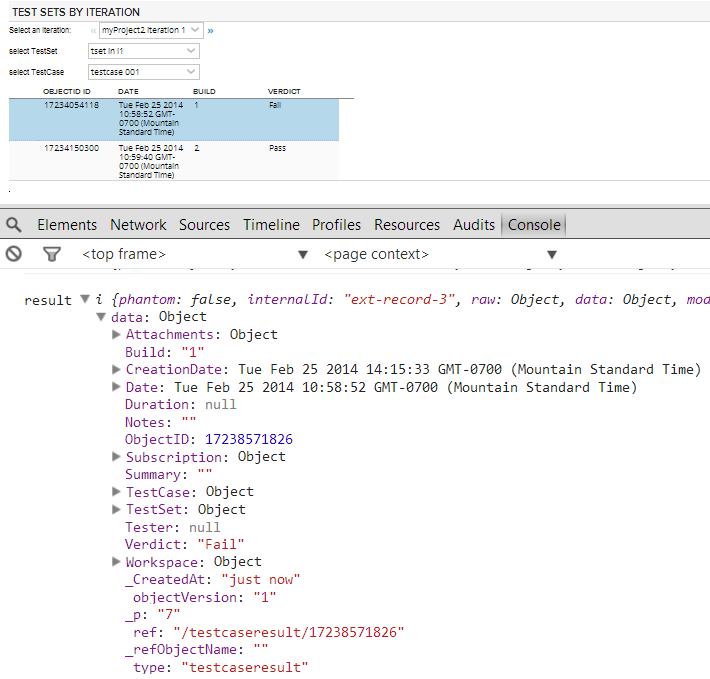

Test Sets by Iteration example
=========================

## Overview
Doulble click on a test case in the grid invokes a function that copies the selected test case result

## License

AppTemplate is released under the MIT license.  See the file [LICENSE](https://raw.github.com/RallyApps/AppTemplate/master/LICENSE) for the full text.
